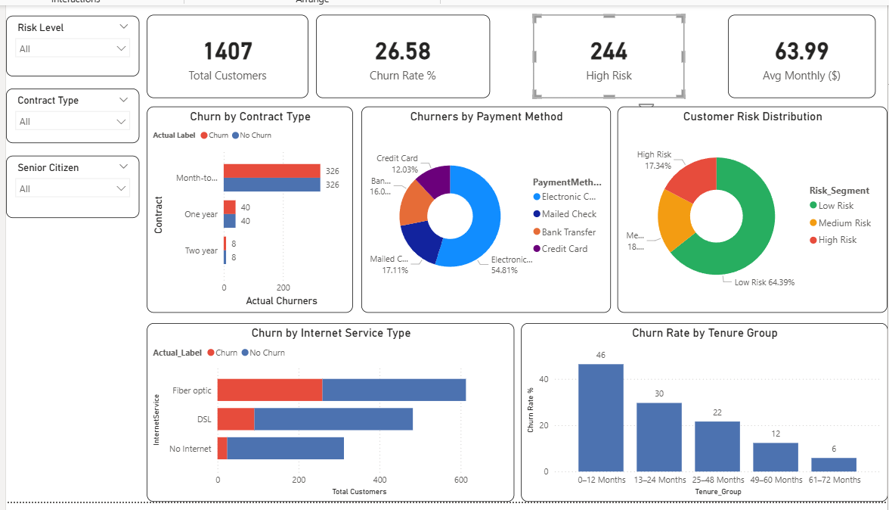
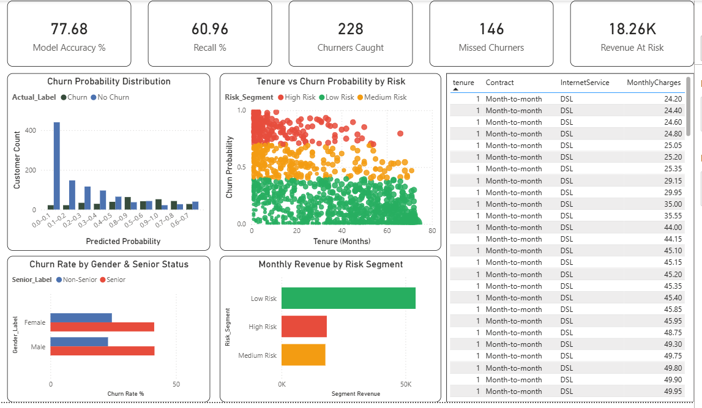
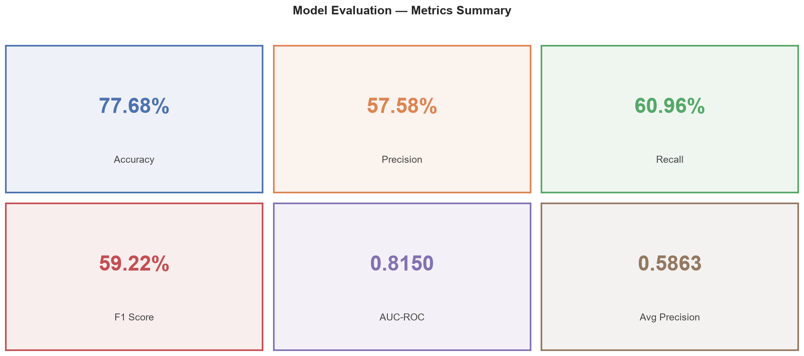
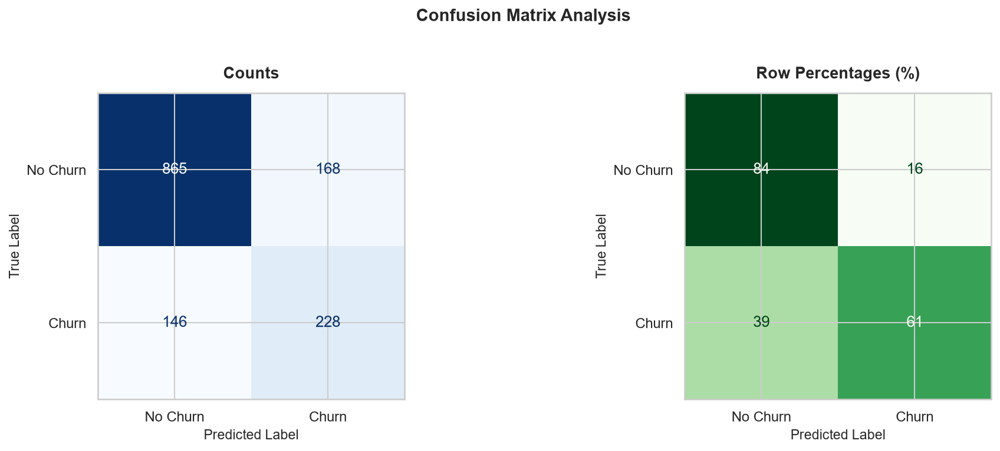
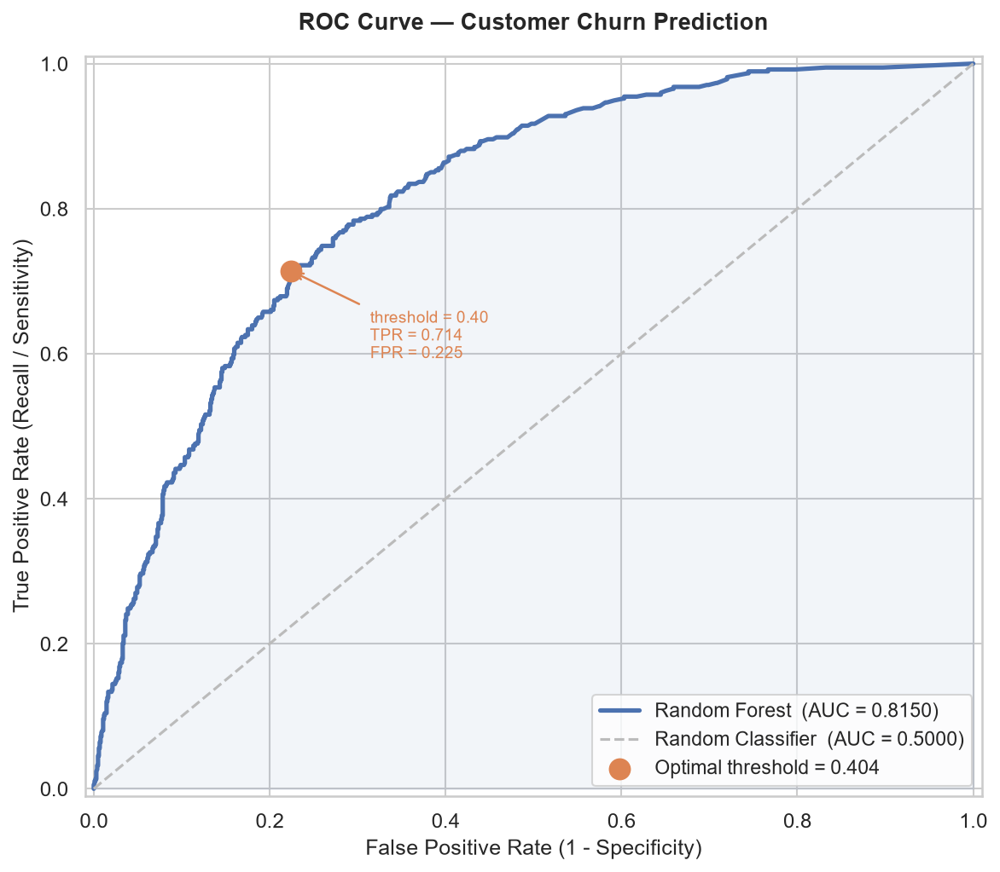
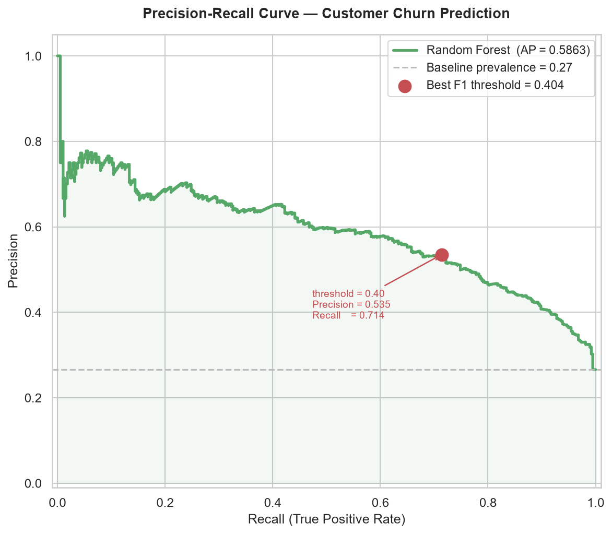
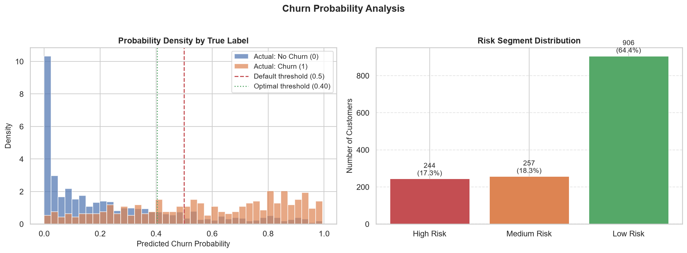
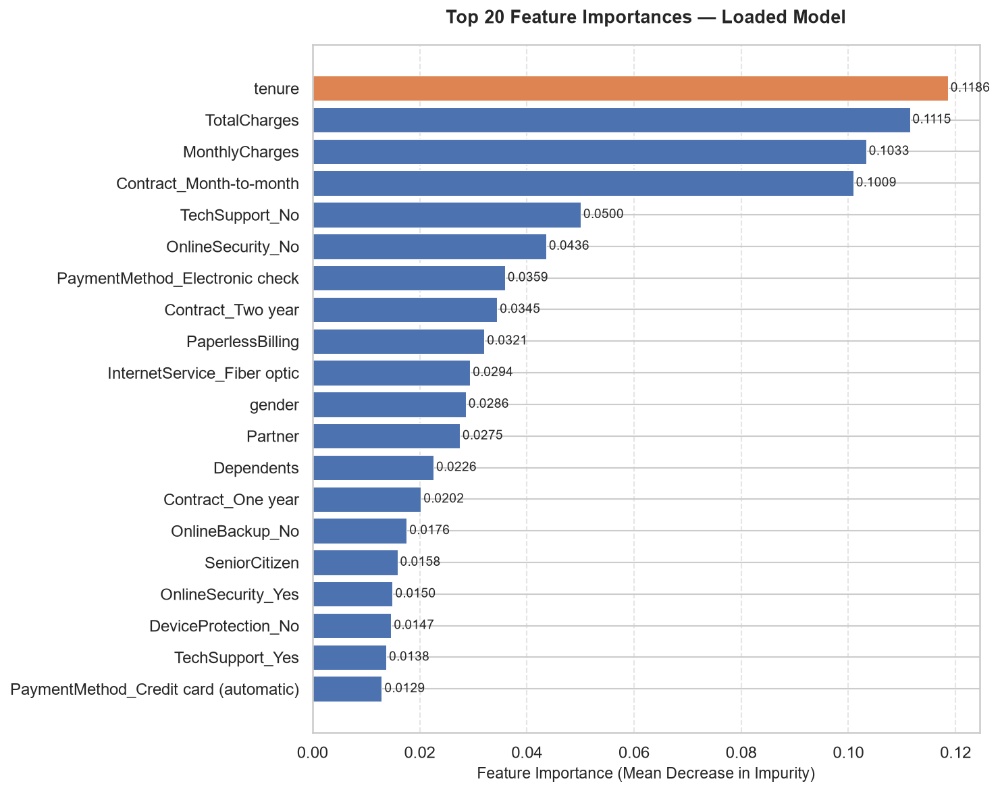

# 🔮 Customer Churn Prediction — Machine Learning + Power BI

<div align="center">


**End-to-end Machine Learning pipeline to predict telecom customer churn
with an interactive Power BI dashboard for the retention team.**

[🔗 View Dashboard](#-dashboard-preview) · [▶️ How to Run](#️-how-to-run) · [📊 Results](#-key-results) · [👤 About Me](#-about-me)

</div>

---

## 📌 Problem Statement

A telecom company is losing approximately **27% of its customers annually** due to churn —
costing millions in lost recurring monthly revenue.

The retention team needs to know **which customers are likely to leave before they do**,
so they can intervene with targeted offers at the right time and protect revenue.

### Business Goals
- Predict which customers will churn with high accuracy
- Identify the **top risk factors** driving customer churn
- Segment customers into **High / Medium / Low Risk** tiers
- Deliver an **interactive Power BI dashboard** the retention team can act on immediately

---

## 📊 Dashboard Preview

### Page 1 — Churn Overview


### Page 2 — Model Performance


> 📁 Power BI file: `dashboard/churn_dashboard.pbix`

---

## 🏆 Key Results

| Metric | Score |
|--------|-------|
| **Model** | Random Forest (Tuned — GridSearchCV) |
| **Accuracy** | 77.68% |
| **Precision** | 57.58% |
| **Recall** | 60.96% |
| **F1 Score** | 59.22% |
| **AUC-ROC** | 0.8150 |
| **Avg Precision (PR)** | 0.5863 |
| **High-Risk Customers Identified** | 244 |


---

## 💡 Key Business Findings

| # | Finding | Impact |
|---|---------|--------|
| 1 | **Month-to-month** customers churn at **3× the rate** of two-year contract customers | Switch incentives to long-term contracts |
| 2 | Customers with **tenure < 12 months** are the highest-risk segment | Prioritise onboarding experience |
| 3 | **Fiber optic** internet users churn more than DSL users | Investigate service quality issues |
| 4 | **Electronic check** payers churn more than auto-payment users | Incentivise auto-pay enrollment |
| 5 | Customers without **TechSupport or OnlineSecurity** churn significantly more | Bundle value-add services |
| 6 | Top ML predictors: `tenure`, `Contract type`, `MonthlyCharges`, `TechSupport`, `OnlineSecurity` | Focus retention spend here |

---

## 🛠️ Tech Stack

| Category | Technology |
|----------|-----------|
| **Language** | Python 3.11 |
| **Data Manipulation** | Pandas 2.0, NumPy 1.24 |
| **Visualisation** | Matplotlib 3.7, Seaborn 0.12 |
| **Machine Learning** | Scikit-learn 1.3 |
| **Class Imbalance** | imbalanced-learn — SMOTE |
| **Model Tuning** | GridSearchCV, StratifiedKFold |
| **Dashboard** | Power BI Desktop (DAX, Power Query) |
| **Model Persistence** | Joblib |
| **Notebook Environment** | Jupyter Notebook |
| **Version Control** | Git & GitHub |

---

## 📁 Project Structure

```
customer-churn-prediction/
│
├── 📂 data/
│   ├── raw/
│   │   └── WA_Fn-UseC_-Telco-Customer-Churn.csv   ← Original dataset (never modified)
│   └── processed/
│       ├── X_train_balanced.csv                    ← SMOTE-balanced training features
│       ├── X_test.csv                              ← Held-out test features (scaled)
│       ├── y_train_balanced.csv                    ← Balanced training labels
│       ├── y_test.csv                              ← Test labels
│       ├── feature_names.csv                       ← Column names after encoding
│       ├── cleaned_data.csv                        ← Cleaned full dataset
│       └── model_predictions.csv                   ← Predictions export for Power BI
│
├── 📂 notebooks/
│   ├── 01_eda.ipynb                ← Exploratory Data Analysis & visualisations
│   ├── 02_preprocessing.ipynb     ← Cleaning, encoding, scaling, SMOTE
│   ├── 03_model_building.ipynb    ← Model training, comparison, tuning
│   └── 04_model_evaluation.ipynb  ← Metrics, evaluation plots, export
│
├── 📂 models/
│   ├── best_model.pkl              ← Saved tuned Random Forest model
│   └── best_model_metadata.json   ← Model parameters, metrics, feature names
│
├── 📂 dashboard/
│   └── churn_dashboard.pbix       ← Power BI dashboard (2 pages)
│
├── 📂 images/
│   ├── dashboard_page1.png
│   ├── dashboard_page2.png
│   ├── 01_metrics_summary.png
│   ├── 02_confusion_matrix.png
│   ├── 03_roc_curve.png
│   ├── 04_precision_recall_curve.png
│   ├── 05_probability_distribution.png
│   └── 06_feature_importance.png
│
├── requirements.txt
├── .gitignore
└── README.md
```

---

## 📂 Dataset

| Property | Detail |
|----------|--------|
| **Name** | Telco Customer Churn |
| **Source** | [IBM Watson Analytics — Kaggle](https://www.kaggle.com/datasets/blastchar/telco-customer-churn) |
| **Rows** | 7,043 customers |
| **Features** | 21 columns |
| **Target Column** | `Churn` (Yes / No) |
| **Class Distribution** | ~73% No Churn / ~27% Churn (imbalanced) |

### Feature Overview

| Feature Type | Columns |
|-------------|---------|
| **Customer Info** | gender, SeniorCitizen, Partner, Dependents |
| **Account Info** | tenure, Contract, PaymentMethod, PaperlessBilling |
| **Services** | PhoneService, MultipleLines, InternetService, OnlineSecurity, OnlineBackup, DeviceProtection, TechSupport, StreamingTV, StreamingMovies |
| **Charges** | MonthlyCharges, TotalCharges |
| **Target** | Churn |

---

## 🔄 Project Workflow

```
📥 Raw Dataset (7,043 rows × 21 columns)
         │
         ▼
┌─────────────────────────────────────┐
│   01_eda.ipynb                      │
│   • Data types & missing values     │
│   • Churn distribution (27% / 73%)  │
│   • Correlation heatmap             │
│   • Contract vs Churn analysis      │
│   • Tenure distribution plots       │
└─────────────────┬───────────────────┘
                  │
                  ▼
┌─────────────────────────────────────┐
│   02_preprocessing.ipynb            │
│   • Fix TotalCharges (str → float)  │
│   • Drop customerID                 │
│   • Label encode binary columns     │
│   • One-hot encode multi-category   │
│   • Stratified train/test split     │
│   • StandardScaler (train only)     │
│   • SMOTE (training data only)      │
│   • Save 6 CSV files to disk        │
└─────────────────┬───────────────────┘
                  │
                  ▼
┌─────────────────────────────────────┐
│   03_model_building.ipynb           │
│   • Load CSVs (fully independent)   │
│   • Train 3 baseline models         │
│   • Compare: Accuracy, F1, AUC-ROC  │
│   • GridSearchCV tuning (5-fold CV) │
│   • Feature importance plot         │
│   • Save best_model.pkl             │
└─────────────────┬───────────────────┘
                  │
                  ▼
┌─────────────────────────────────────┐
│   04_model_evaluation.ipynb         │
│   • Load model + test data from disk│
│   • Generate predictions + risk tier│
│   • Confusion Matrix (count + %)    │
│   • ROC Curve + optimal threshold   │
│   • Precision-Recall Curve          │
│   • Probability distribution plot   │
│   • Feature importance (from .pkl)  │
│   • Export model_predictions.csv    │
└─────────────────┬───────────────────┘
                  │
                  ▼
┌─────────────────────────────────────┐
│   Power BI Dashboard                │
│   • Import model_predictions.csv    │
│   • 11 DAX measures                 │
│   • 11 calculated columns           │
│   • Page 1: Churn Overview          │
│   • Page 2: Model Performance       │
│   • Synced slicers across pages     │
└─────────────────────────────────────┘
```

---

## 📈 Model Comparison

| Model | Accuracy | Precision | Recall | F1 Score | AUC-ROC |
|-------|----------|-----------|--------|----------|---------|
| Logistic Regression | 73.28% | 49.83% | 78.34% | 60.91% | 0.8339 |
| Decision Tree | 73.28% | 49.78% | 60.43% | 54.59% | 0.6918 |
| Random Forest (baseline) | 77.47% | 57.33% | 59.63% | 58.45% | 0.8131 |
| **Random Forest (tuned) ✅** | **77.68%** | **57.58%** | **60.96%** | **59.22%** | **0.8150** |


### Why Random Forest Won

- Handles **non-linear relationships** between features (e.g., tenure × contract type interaction)
- **Robust to outliers** in MonthlyCharges
- Ensemble approach **reduces overfitting** compared to a single Decision Tree
- Provides **feature importance** scores for business interpretation
- Works well with **mixed data types** (numeric + encoded categorical)

---

## 🖼️ Evaluation Plots

### Metrics Summary


### Confusion Matrix


### ROC Curve


### Precision-Recall Curve


### Churn Probability Distribution


### Feature Importance


---

## ▶️ How to Run

### Step 1 — Clone the Repository
```bash
git clone https://github.com/abhibaw/customer-churn-prediction.git
cd customer-churn-prediction
```

### Step 2 — Create Virtual Environment
```bash
# Create
python -m venv venv

# Activate (Windows)
venv\Scripts\activate

# Activate (Mac / Linux)
source venv/bin/activate
```

### Step 3 — Install Dependencies
```bash
pip install -r requirements.txt
```

### Step 4 — Download Dataset
```
1. Visit: https://www.kaggle.com/datasets/blastchar/telco-customer-churn
2. Download: WA_Fn-UseC_-Telco-Customer-Churn.csv
3. Place in: data/raw/WA_Fn-UseC_-Telco-Customer-Churn.csv
```

### Step 5 — Run Notebooks in Order
```bash
jupyter notebook
```

| Order | Notebook | What it does |
|-------|----------|-------------|
| 1st | `01_eda.ipynb` | Explore data, visualise patterns |
| 2nd | `02_preprocessing.ipynb` | Clean, encode, SMOTE, save CSVs |
| 3rd | `03_model_building.ipynb` | Train models, tune, save .pkl |
| 4th | `04_model_evaluation.ipynb` | Evaluate, plot, export predictions |


### Step 6 — Open Power BI Dashboard
```
Option A (Existing dashboard):
  File → Open → dashboard/churn_dashboard.pbix

Option B (Build fresh):
  Home → Get Data → Text/CSV
  → Select: data/processed/model_predictions.csv
  → Load → Build visuals using the DAX measures
```

---

## 📦 Requirements

```
pandas==2.0.3
numpy==1.24.3
matplotlib==3.7.2
seaborn==0.12.2
scikit-learn==1.3.0
imbalanced-learn==0.11.0
joblib==1.3.1
jupyter==1.0.0
```

Install all at once:
```bash
pip install -r requirements.txt
```

---

## 🧠 Key Concepts Demonstrated

### 1. Handling Class Imbalance with SMOTE
```python
# Applied ONLY to training data — never test data
smote = SMOTE(random_state=42)
X_train_bal, y_train_bal = smote.fit_resample(X_train_scaled, y_train)
# Before: 73% No Churn / 27% Churn
# After:  50% No Churn / 50% Churn
```

### 2. Preventing Data Leakage
```python
# StandardScaler: fit on train, transform both
scaler = StandardScaler()
X_train_scaled = scaler.fit_transform(X_train)   # fit + transform
X_test_scaled  = scaler.transform(X_test)         # transform ONLY
```

### 3. Self-Contained Notebook Architecture
```python
# Each notebook loads from saved CSV files — not memory variables
# This means every notebook runs independently after kernel restart
X_train = pd.read_csv("data/processed/X_train_balanced.csv").values
y_train = pd.read_csv("data/processed/y_train_balanced.csv").values.ravel()
```

### 4. Choosing the Right Metric
```
Why F1 Score over Accuracy?

Test set = 73% No Churn.
A model predicting "No Churn" for everyone = 73% accuracy.
But it catches ZERO churners — completely useless.

F1 balances Precision (false alarms) and Recall (missed churners).
For churn: Recall matters most — missing a churner costs more
than a wasted retention offer.
```

### 5. Risk Segmentation for Business Use
```python
def assign_risk(probability):
    if   probability >= 0.70: return "High Risk"
    elif probability >= 0.40: return "Medium Risk"
    else:                     return "Low Risk"
```

---

## 📊 Power BI Dashboard Details

### Page 1 — Churn Overview
| Visual | Type | Fields Used |
|--------|------|------------|
| Total Customers | KPI Card | COUNT of rows |
| Churn Rate % | KPI Card | DAX measure |
| High Risk Count | KPI Card | DAX measure |
| Avg Monthly Charges | KPI Card | DAX measure |
| Churn by Contract | Bar Chart | Contract (DAX column) |
| Churn by Payment Method | Donut Chart | PaymentMethod (DAX column) |
| Churn by Internet Service | Stacked Bar | InternetService (DAX column) |
| Risk Distribution | Donut Chart | Risk_Segment |
| Churn Rate by Tenure Group | Column Chart | Tenure_Group (DAX column) |

### Page 2 — Model Performance
| Visual | Type | Fields Used |
|--------|------|------------|
| Model Accuracy % | KPI Card | DAX measure |
| Recall % | KPI Card | DAX measure |
| Churners Caught | KPI Card | DAX measure |
| Missed Churners | KPI Card | DAX measure |
| Revenue At Risk | KPI Card | DAX measure |
| Probability Distribution | Column Chart | Prob_Bin (DAX column) |
| Tenure vs Probability | Scatter Chart | tenure, Churn_Probability |
| Revenue by Risk Segment | Bar Chart | Risk_Segment, MonthlyCharges |
| High Risk Customer Table | Table | All key columns, filtered |


## 🤝 Contributing

Pull requests are welcome. For major changes, please open an issue first.

---

## 📄 License

This project is open source under the [MIT License](LICENSE).

---

## ⭐ Show Your Support

If this project helped you understand ML pipelines or Power BI dashboards,
please consider **starring ⭐ the repository** — it helps others find it!

---

## 👤 About Me

**Abhishek Bawane**

Data Analyst | Power BI Developer | Business Intelligence Analyst

I'm a Data Analyst with 2 years of experience with full-stack data analytics capability.

Skilled in Power BI (DAX, Power Query), advanced SQL,
Python (Pandas, NumPy, Scikit-learn), and Excel.

| | |
|--|--|
| 📧 **Email** | abhishekbawane04@gmail.com |
| 💼 **LinkedIn** | [linkedin.com/in/abhishek-bawane-31ba70228](https://www.linkedin.com/in/abhishek-bawane-31ba70228/) |
| 🐙 **GitHub** | [github.com/Abhishek_bawane](https://github.com/abhibaw) |
| 📍 **Location** | Pune, Maharashtra, India |

---

<div align="center">

**⭐ If you found this useful, please star the repository! ⭐**

Made by Abhishek Bawane

</div>
